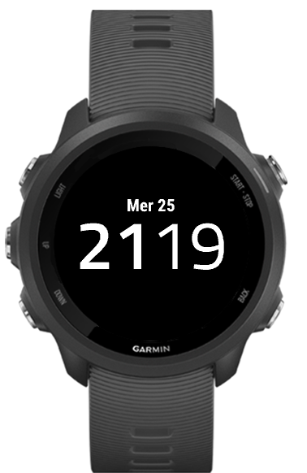
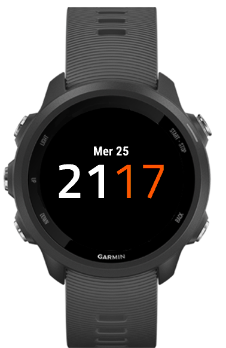

# MyMinimalFace for Garmin 245 and 245m

A specific face with only time and date. If battery levl is inferior of 10% , a icon battery is add

## Installation

copy of Build/MyMinimalFace.prg in your watch (/GARMIN/APPS/)

